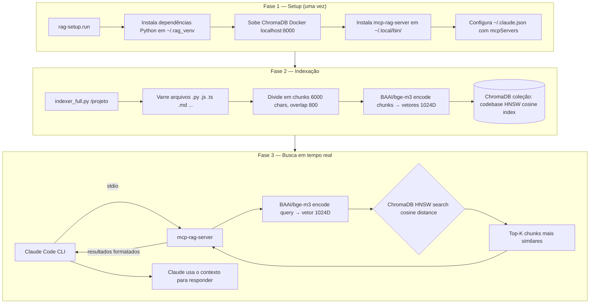
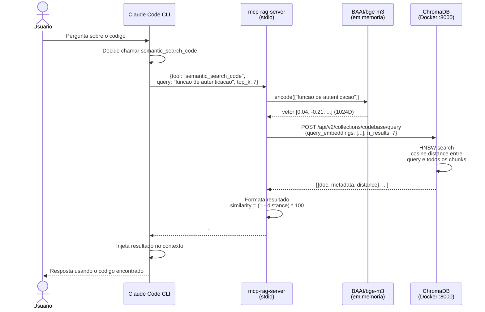
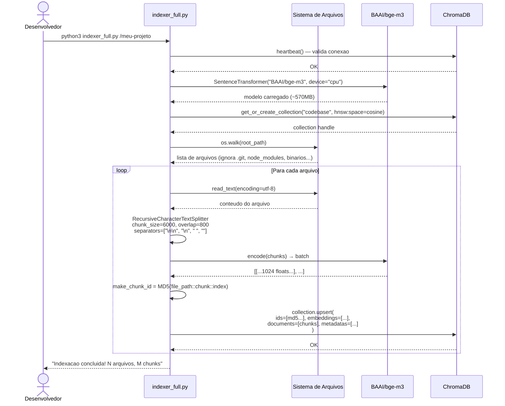
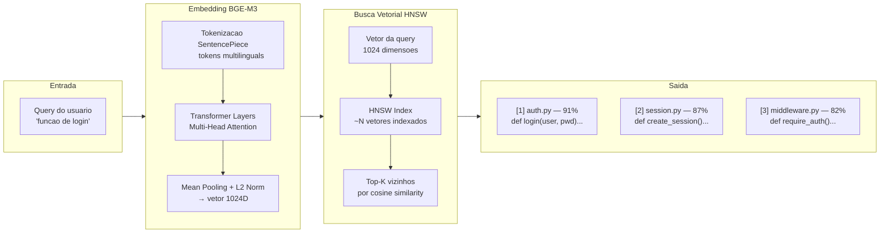

# How It Works — RAG Local + Claude Code

## Por que BGE-M3?

Foram avaliados dois modelos para este RAG:

| Modelo | Dims | Context | Foco | Status |
|---|---|---|---|---|
| `all-MiniLM-L6-v2` | 384D | 256 tokens | Geral | Substituído |
| `jinaai/jina-embeddings-v2-base-code` | 768D | 8192 tokens | Código | Incompatível com transformers ≥4.40 |
| `BAAI/bge-m3` | 1024D | 8192 tokens | Multilingual | **Escolhido** |

O `jina-embeddings-v2-base-code` seria ideal para código puro, mas seu código customizado referencia `find_pruneable_heads_and_indices`, função removida do `transformers` na versão 4.40 e o modelo não foi atualizado. O BGE-M3 funciona com transformers 5.x, tem 1024D (representação mais rica) e contexto de 8192 tokens.

---

## O que é o BGE-M3

O `BAAI/bge-m3` (Beijing Academy of AI) é um modelo de **sentence embeddings** de última geração. Ele converte qualquer texto em um vetor de **1024 dimensões** que representa o significado semântico do conteúdo.

Textos semanticamente similares ficam próximos no espaço vetorial:

```
"função que valida e-mail"    → [0.04, -0.21, 0.67, ...]  (1024 números)
"verificar formato de email"  → [0.05, -0.20, 0.65, ...]  (muito próximo!)
"conexão com banco de dados"  → [0.81,  0.33, -0.12, ...]  (distante)
```

**Vantagens sobre all-MiniLM-L6-v2:**
- **8192 tokens** de contexto (era 256) — funções inteiras cabem em um chunk
- **1024 dimensões** (era 384) — representação muito mais rica e precisa
- **State-of-the-art** no MTEB benchmark (maior benchmark de retrieval)
- **Chunks maiores**: 6000 chars/chunk (era 2400) — menos fragmentação de código

---

## Visão Geral da Solução



---

## Diagrama de Sequencia — Busca Semantica



---

## Diagrama de Sequencia — Indexacao



---

## Como o Modelo Funciona Internamente

O `BGE-M3` e baseado em arquitetura XLM-RoBERTa com camadas de attention empilhadas:

```
Texto de entrada
      |
[Tokenizacao SentencePiece — multilingual]
      |
[N x Transformer Layers com Multi-Head Self-Attention]
      |
[Mean Pooling sobre tokens nao-padding]
      |
[Normalizacao L2]
      |
Vetor de 1024 dimensoes (embedding normalizado)
```

**Por que distancia cosseno?**

A distancia cosseno mede o angulo entre dois vetores, ignorando a magnitude. Ideal para embeddings normalizados porque:
- Textos curtos e longos sobre o mesmo topico ficam proximos
- A normalizacao L2 do BGE-M3 torna cosine = dot product (mais rapido)

```
similarity = 1 - cosine_distance
           = dot(A, B)   # quando ambos sao vetores L2-normalizados
```

---

## Fluxo de Dados Detalhado



---

## Estrutura dos Chunks no ChromaDB

Cada chunk armazenado tem:

| Campo | Tipo | Exemplo |
|---|---|---|
| `id` | string | `MD5("src/auth.py::chunk::0")` |
| `embedding` | float[1024] | `[0.04, -0.21, ...]` |
| `document` | string | `"def login(user, pwd):\n    ..."` |
| `file_path` | metadata | `/home/jocsa/projeto/src/auth.py` |
| `chunk_index` | metadata | `0` |
| `file_name` | metadata | `auth.py` |
| `relative_path` | metadata | `src/auth.py` |

O ID e deterministico: o mesmo arquivo + mesmo indice sempre gera o mesmo MD5. Isso permite **upsert idempotente** — reindexar um arquivo nao cria duplicatas.

---

## Parametros e seus Impactos

| Parametro | Valor anterior | Valor atual | Impacto |
|---|---|---|---|
| `EMBEDDING_MODEL` | all-MiniLM-L6-v2 | BAAI/bge-m3 | Melhor qualidade, mais dimensoes |
| `CHUNK_SIZE` | 2400 chars | 6000 chars | Funcoes inteiras cabem em 1 chunk |
| `CHUNK_OVERLAP` | 400 chars | 800 chars | Mais continuidade entre chunks |
| `embedding dims` | 384D | 1024D | Representacao muito mais rica |
| `context window` | 256 tokens | 8192 tokens | Nao trunca mais codigo longo |
| `top_k` | 7 (padrao) | 7 (padrao) | Quantidade de chunks por busca |
| `MAX_FILE_SIZE` | 500KB | 500KB | Limite de tamanho de arquivo |
| `hnsw:space` | cosine | cosine | Melhor para embeddings normalizados |
| `device` | cpu | cpu | Sem dependencia de GPU |

---

## Integracao com Claude Code

O Claude Code se conecta ao `mcp-rag-server` via **stdio** (protocolo MCP). O servidor e iniciado como subprocesso quando o Claude Code carrega:

```
claude (processo principal)
    └── mcp-rag-server (subprocesso, stdio)
            ├── carrega BAAI/bge-m3 em memoria (~570MB)
            └── mantem conexao HTTP com ChromaDB
```

A comunicacao e JSON-RPC sobre stdin/stdout. O Claude envia uma chamada de ferramenta e recebe o resultado formatado de volta — tudo sem expor portas ou APIs externas.

---

## Migracao do modelo antigo

Ao trocar de modelo, a colecao ChromaDB precisa ser recriada — as dimensoes sao incompativeis (384D vs 1024D). O procedimento:

```bash
# 1. Deletar a colecao antiga
python3 -c "
import chromadb
c = chromadb.HttpClient(host='localhost', port=8000)
c.delete_collection('codebase')
print('Colecao deletada')
"

# 2. Reindexar o projeto com o novo modelo
python3 indexer_full.py /caminho/do/projeto
```
